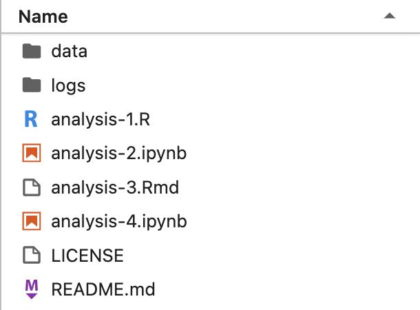
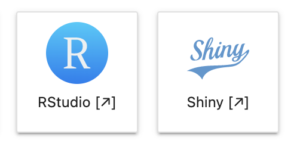

<!-- badges: start -->

 
<!-- badges: end -->

# Binder for reproducible analyses with R, Python and Jupyter
This repo is an example of making a bunch of R and Python analyses available in the same [Binder](https://mybinder.org/) instance. 

Click the badges above to launch a live, interactive Jupyter Lab or RStudio session in your browser. Execute the notebooks/scripts, edit them, create new ones and upload your own data to analyse. 

You can also launch each of the analyses in this repo from the Jupyter Lab file browser (Analyses 2 & 4), or select RStudio (Analysis 1) and Shiny (Analysis 3) from the launcher. You can also launch them from the badges in the sections below.

 

The sessions last for as long as you are using them and will disappear once you are inactive for 5-10 minutes. Any unsaved progress will disappear (each session starts with exactly what is in this repo), so if you want to save any progress/edits you make you will need to download them to your computer.

This repo was broadly constructed following this [Zero-to-Binder](https://the-turing-way.netlify.app/communication/binder/zero-to-binder.html) tutorial in The Turing Way docs. I followed both the Python and R setups.  I would **not** recommend using the `holepunch` package to setup an R Binder as the project has been unmaintained for over two years and when I used it it failed to create a working Dockerfile. In fact, the method I settled on (described in this repo) does not define a Dockerfile at all, instead leaning on the excellent work of the [`repo2docker`](https://github.com/jupyterhub/repo2docker) folks which now have a very slick system for creating Docker and Binder instances from a GitHub repository. Kudos to them and their work.

The main things that have been done differently from Zero-to-Binder in this example are:
1. Using [`renv`](https://rstudio.github.io/renv/index.html) to manage the R environment instead of `install.R`, due to it's ability to specify explicit versions of R packages and their source. [`renv::restore()`](https://rstudio.github.io/renv/reference/restore.html) is executed in the `.binder/postBuild` script. See [#660](https://github.com/jupyterhub/repo2docker/issues/660) for a discussion on this.
2. Launch an RMarkdown file as an [interactive notebook using RShiny](https://bookdown.org/yihui/rmarkdown/shiny.html). See [#799](https://github.com/jupyterhub/repo2docker/issues/799) for a discussion on this.

## Analysis 1: R script in RStudio
 
(Badge simply opens RStudio, not the specific file within the RStudio session ☹️)

The R script `analysis-1.R` simply plots data in the `data/` directory as scatter plots with linear regression lines fitted. Clicking the badge above will start an RStudio session, from which you can navigate to `analysis-1.R` and run it as if working in RStudio Desktop. You can edit this script, create new scripts and files, and upload your own data for analysis.

URL pattern to launch RStudio: 
`https://mybinder.org/v2/gh/<user>/<repo>/<branch>?urlpath=rstudio`

MyBinder requirements:
 - [`.binder/runtime.txt`](https://repo2docker.readthedocs.io/en/latest/config_files.html#runtime-txt-specifying-runtimes) to define the version on R (from [MRAN](https://mran.microsoft.com/documents/rro/reproducibility)) to use with the format `r-<version>-<year>-<month>-<day>` as the only line of the file.
 - [`.binder/install.R`](https://repo2docker.readthedocs.io/en/latest/config_files.html#install-r-install-an-r-rstudio-environment) (optional) where you can define packages you wish to install
 - [`.binder/postBuild`](https://repo2docker.readthedocs.io/en/latest/config_files.html#postbuild-run-code-after-installing-the-environment) (optional) where `renv::restore()` is called to install the R packages explicitly defined in `.binder/renv.lock`, after the Docker image has been built.

## Analysis 2: Jupyter Notebook with an R kernel in a Jupyter Notebook session

The Jupyter Notebook `analysis-2.ipynb` simply plots data in the `data/` directory as scatter plots with linear regression lines fitted, using R. Clicking the badge above will launch a Jupyter Notebook session for just this notebook. You can then execute the cells with a live R kernel in the background. You can add code and edit the notebook but you cannot easily add data to analyse. Please see the JupyterLab badge (above) or [Analysis 4](#analysis-4-jupyter-notebook-with-a-python-kernel-in-a-jupyter-lab-session) (below) for a Jupyter Lab session, which has a better user interaface for such things.

URL pattern to launch a standalone Jupyter Notebook: 
`https://mybinder.org/v2/gh/<user>/<repo>/<branch>?filepath=path/to/notebook.ipynb`

MyBinder requirements:
 - [`.binder/runtime.txt`](https://repo2docker.readthedocs.io/en/latest/config_files.html#runtime-txt-specifying-runtimes) to define the version on R (from [MRAN](https://mran.microsoft.com/documents/rro/reproducibility)) to use with the format `r-<version>-<year>-<month>-<day>` as the only line of the file.
 - [`.binder/install.R`](https://repo2docker.readthedocs.io/en/latest/config_files.html#install-r-install-an-r-rstudio-environment) (optional) where you can define packages you wish to install
 - [`.binder/postBuild`](https://repo2docker.readthedocs.io/en/latest/config_files.html#postbuild-run-code-after-installing-the-environment) (optional) where `renv::restore()` is called to install the R packages explicitly defined in `.binder/renv.lock`, after the Docker image has been built.
 - The R environment is the same as the one used in the RStudio instance (see [Analysis 1](#analysis-1-r-script-in-rstudio).

## Analysis 3: RMarkdown notebook in an RShiny session

The RMarkdown notebook `analysis-3.Rmd` simply plots data in the `data/` directory as scatter plots with linear regression lines fitted, and embeds a couple of RShiny widgets, within an RMarkdown file. This is then rendered by RShiny as a live, interactive HTML document. Cells cannot be executed or edited like a Jupyter notebook, but the widgets can be interacted with like in an RShiny dashboard.

This configuration took a lot of digging to uncover an implementation for. The functionality [is well established within in R](https://bookdown.org/yihui/rmarkdown/shiny.html), but its implementation within the MyBinder project was unclear. These two pull requests ([#799](https://github.com/jupyterhub/repo2docker/issues/799) & [#891](https://github.com/jupyterhub/repo2docker/pull/891)) in the [repo2docker](https://github.com/jupyterhub/repo2docker) GitHub repo eventually led to a solution. Please note that in order for this setup to work the `.Rmd` file **must** be located in the base directory of the repo, subfolders are not supported for this functionality. The name of the file does not matter.

RShiny dashboards are also [supported in MyBinder](https://bookdown.org/yihui/rmarkdown/shiny.html) using an `server.R` and `ui.R` configuration. This setup is not demonstrated in this repo. 

URL pattern to launch an RMarkdown file with RShiny: 
`https://mybinder.org/v2/gh/<user>/<repo>/<branch>?urlpath=shiny/rmarkdownfile.Rmd`

MyBinder requirements:
 - [`.binder/runtime.txt`](https://repo2docker.readthedocs.io/en/latest/config_files.html#runtime-txt-specifying-runtimes) to define the version on R (from [MRAN](https://mran.microsoft.com/documents/rro/reproducibility)) to use with the format `r-<version>-<year>-<month>-<day>` as the only line of the file.
 - [`.binder/install.R`](https://repo2docker.readthedocs.io/en/latest/config_files.html#install-r-install-an-r-rstudio-environment) (optional) where you can define packages you wish to install. Must include `shiny`, `rmarkdown` and `shinydashboard`.
 - [`.binder/postBuild`](https://repo2docker.readthedocs.io/en/latest/config_files.html#postbuild-run-code-after-installing-the-environment) (optional) where `renv::restore()` is called to install the R packages explicitly defined in `.binder/renv.lock`, after the Docker image has been built. Must include `shiny`, `rmarkdown` and `shinydashboard`.
 - The RMarkdown file, `rmarkdownfile.Rmd`, must be located in the base directory of the repository. It unfortunately cannot be in a subdirectory/folder of the repo as RShiny will not recognise it.
 - R package `IRkernel`, which creates an R kernel for Jupyter to use, is included in the `repo2docker` infrastructure so does not need to be included by the user.

## Analysis 4: Jupyter Notebook with a Python kernel in a Jupyter Lab session

The Jupyter Notebook `analysis-4.ipynb` simply plots data in the `data/` directory as scatter plots with linear regression lines fitted using Python. Clicking the badge above will launch a Jupyter Lab session, opened on the `analysis-4.ipynb` notebook. You can execute the cells in the notebook which will be run using the live Python kernel in the background. You can add code, edit the notebook and add your own data to analyse (using the file browser on the left hand pane).

URL pattern to launch a Jupyter Notebook in Jupyter Lab:
`https://mybinder.org/v2/gh/<user>/<repo>/<branch>?urlpath=lab/tree/path/to/notebook.ipynb`

MyBinder requirements:
 - [`.binder/environment.yml`](https://repo2docker.readthedocs.io/en/latest/config_files.html#environment-yml-install-a-conda-environment) to define the **extra** packages to be installed using [conda](https://docs.conda.io/projects/conda/en/latest/user-guide/tasks/manage-environments.html#creating-an-environment-from-an-environment-yml-file). The base `repo2docker` infrastructure already installs `python`, `jupyter`, `IPython`, `ipykernel`, etc. so the user simply uses this file to define the packages needed in their analyses/code.
